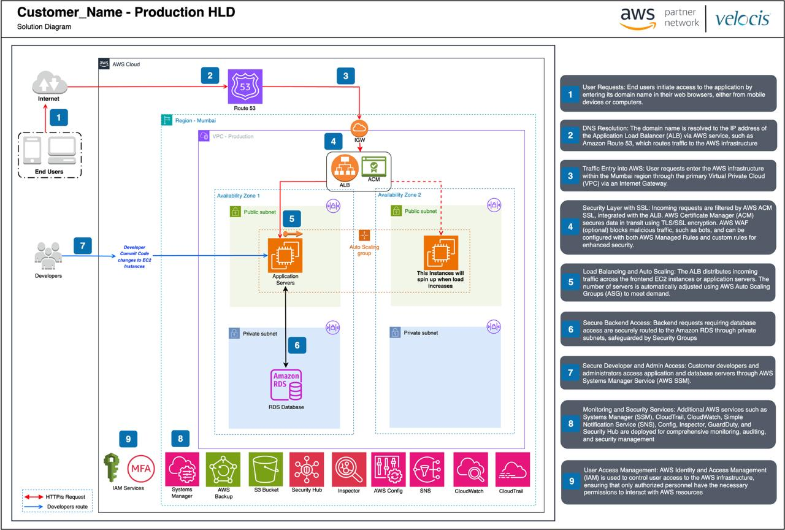

<h1><b>FULL-SCALE APPLICATION DEPLOYMENT USING AWS SERVICES</b></h1>

## 📘 **Project Overview**
This project demonstrates a **production-grade, highly available, and scalable web application deployment** using core AWS infrastructure services.  
The architecture follows industry best practices and incorporates networking, compute, storage, content delivery, monitoring, and domain management.

---

## ⭐ **STAR Method Explanation**

### **S – Situation**
During my cloud learning journey, I wanted to build a **real-world, production-style architecture** that reflects how scalable and globally accessible applications are deployed in enterprises.  
The objective was to design an environment that could handle traffic spikes, maintain uptime across multiple Availability Zones, and deliver fast content worldwide.

---

### **T – Task**
My goal was to deploy a **complete web application** using AWS best practices, ensuring:

- High availability  
- Auto scaling capability  
- Secure routing  
- Global content distribution  
- Proper monitoring and observability  

The solution needed to be fully cloud-native and production ready.

---

### **A – Action**
To achieve this, I architected and deployed the following components:

#### 🔹 **1. Network Setup (VPC Architecture)**
- Created a **VPC** with **public and private subnets** across multiple Availability Zones.
- Configured **route tables**, **Internet Gateway**, and **NAT Gateway** for controlled outbound access.
- Implemented **least-privilege Security Groups** and **NACLs**.

#### 🔹 **2. Compute & Load Balancing**
- Deployed EC2 instances inside an **Auto Scaling Group (ASG)** for automatic scaling based on demand.
- Used an **Application Load Balancer (ALB)** to distribute traffic across EC2 instances in multiple AZs.
- Configured ALB listeners, target groups, and health checks.

#### 🔹 **3. Storage & Static Content**
- Hosted application static assets (images, CSS, JS) in an **S3 bucket**.
- Integrated **Amazon CloudFront** as a global CDN to reduce latency and accelerate global content delivery.

#### 🔹 **4. Domain Management**
- Used **Route 53** to manage the custom domain.
- Configured A records and alias routing to point to the ALB and CloudFront distribution.

#### 🔹 **5. Identity & Access Management**
- Attached **IAM Roles** to EC2 and Lambda (if used) for secure permissions.
- Ensured least-privilege access to S3, CloudWatch, and Auto Scaling APIs.

#### 🔹 **6. Logging & Monitoring**
- Set up **Amazon CloudWatch** metrics, dashboards, and alarms.
- Monitored:
  - Auto Scaling behavior  
  - ALB request counts & latencies  
  - EC2 instance health  
  - Application logs  

---

### **R – Result**
The final deployment achieved:

- **High Availability**: Application served across multiple AZs
- **Automatic Scaling**: ASG scaled out/in during load testing
- **Global Performance**: CloudFront drastically reduced latency for users worldwide
- **Secure Infrastructure**: IAM, SGs, VPC isolation maintained cloud security best practices
- **Production Readiness**: The architecture mirrors real enterprise-grade deployments

This project significantly strengthened my understanding of:

- AWS networking  
- Scalable cloud architectures  
- Global content delivery  
- Production-grade DevOps design  

---

## 🏗️ **Architecture Overview**

Below is a summary of the infrastructure components used:

- **VPC** (Public & Private Subnets)
- **Internet Gateway + NAT Gateway**
- **EC2 Auto Scaling Group**
- **Application Load Balancer**
- **Amazon S3** (Static Hosting)
- **Amazon CloudFront** (Content Delivery Network)
- **Route 53** (DNS & Domain Management)
- **IAM Roles & Policies**
- **CloudWatch Monitoring & Alarms**

---

## 🧩 **High-Level Architecture Diagram (Optional)**

---

## 🚀 **Key Features**

* Fully automated and scalable backend
* Zero downtime due to multi-AZ deployment
* Low latency global distribution via CloudFront
* Secure infrastructure using IAM & Security Groups
* Automated health checks and monitoring dashboards

---

## 📂 **Technologies Used**

| Service        | Purpose                              |
| -------------- | ------------------------------------ |
| **VPC**        | Network isolation & routing          |
| **EC2**        | Application compute layer            |
| **ALB**        | Traffic distribution & health checks |
| **ASG**        | Auto scaling infrastructure          |
| **S3**         | Static asset storage                 |
| **CloudFront** | Global caching & CDN                 |
| **Route 53**   | Domain management & DNS              |
| **IAM**        | Role-based access control            |
| **CloudWatch** | Logging, alarms, dashboards          |

---

## 📌 **Conclusion**

This project replicates how modern cloud-native applications are deployed in production using AWS services.
It demonstrates real-world architectural patterns for scalability, security, and reliability—essential skills for cloud and DevOps engineers.

